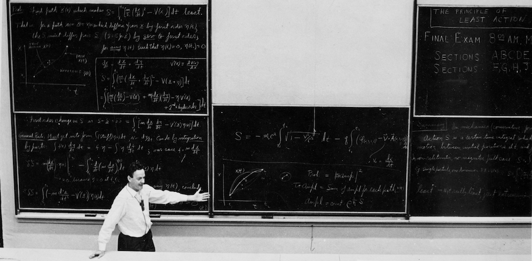

# Problem Solving in C++

> The real prize is the pleasure of finding things out, the kick in the discovery, the observation that other people use it. Those are the real things!

*Richard Feynman*

This is a small collection of routines and algorithms to solve selected problems in science and mathematics. The best way to learn anything is to build toy projects. 

## Modern C++ Programming

### C++ Basics

* [Hello World](modern_cpp_programming/intro_to_c++/hello_world.cpp)
* [Declarations and assignments statements](modern_cpp_programming/intro_to_c++/declarations_and_assignments.cpp)
* [Reading terminal input and producing output](modern_cpp_programming/intro_to_c++/get_info.cpp)
* [Using a library function - sqrt()](modern_cpp_programming/intro_to_c++/function_basics.cpp)
* [Writing a custom function to calculate the value of an investment in a risk-free bank account](modern_cpp_programming/intro_to_c++/user_defined_funcs.cpp)
* [Declarations](modern_cpp_programming/intro_to_c++/declarations.cpp)
* [Structure of declarations](modern_cpp_programming/intro_to_c++/structure_of_declarations.cpp)
* [Identifiers in C++](modern_cpp_programming/intro_to_c++/names.cpp)

## Computational Physics

### Harmonic Oscillators

* [Simple Harmonic Motion](computational_physics/harmonic_oscillators/simple_pendulum.cpp)

## Numerical Algorithms

### Python Notebooks

* [Systems of Linear Algebraic equations](numerical_algorithms/systems_of_linear_algebraic_equations/systems_of_linear_algebraic_equations.ipynb)

### Implementation

* [Gaussian elimination with partial pivoting](numerical_algorithms/systems_of_linear_algebraic_equations/gauss_elim.cpp)
* [LU Factorzization] (numerical_algorithms/systems_of_linear_algebraic_equations/ludcmp.cpp)
